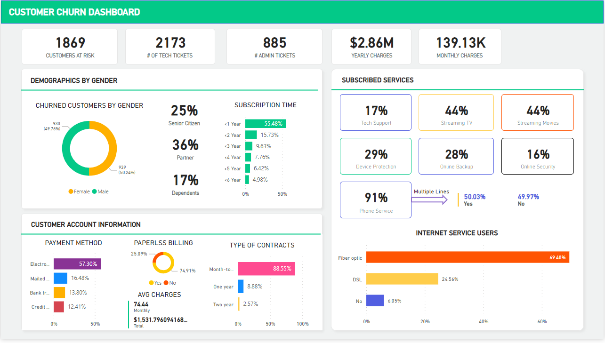
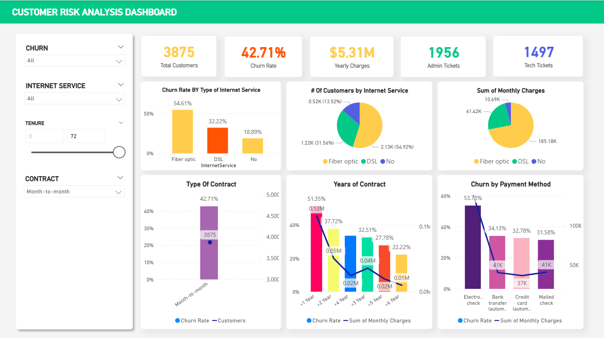

# Brazilian E-Commerce Public Dataset by Olist

This dataset is from Kaggle (https://www.kaggle.com/datasets/olistbr/brazilian-ecommerce)

### About OLIST

Olist is a Brazilian e-commerce technology company and marketplace integrator that connects small and medium-sized businesses to customers through multiple online marketplaces, enabling merchants to list products, manage orders, inventory, payments and logistics via a unified platform; it has grown into a significant e-commerce ecosystem and also provided the public Olist E-commerce dataset commonly used for exploratory data analysis.

#### Thai

Olist เป็นบริษัทเทคโนโลยีอี-คอมเมิร์ซจากประเทศบราซิลที่ทำหน้าที่เป็นแพลตฟอร์มรวมหลายตลาดออนไลน์ ช่วยให้ธุรกิจขนาดเล็กและกลางสามารถเชื่อมต่อกับลูกค้าผ่านตลาดออนไลน์ต่าง ๆ โดยจัดการการลงสินค้า คำสั่งซื้อ สต็อกสินค้า การชำระเงิน และโลจิสติกส์ทั้งหมดผ่านระบบเดียวกัน ซึ่งเติบโตเป็นระบบนิเวศอี-คอมเมิร์ซที่สำคัญและเป็นผู้เผยแพร่ชุดข้อมูลสาธารณะ Olist E-commerce ที่ใช้ในการวิเคราะห์ข้อมูลเชิงสำรวจบ่อยครั้ง.

### Data Description (From Kaggle)

"""Welcome! This is a Brazilian ecommerce public dataset of orders made at Olist Store. The dataset has information of 100k orders from 2016 to 2018 made at multiple marketplaces in Brazil. Its features allows viewing an order from multiple dimensions: from order status, price, payment and freight performance to customer location, product attributes and finally reviews written by customers. We also released a geolocation dataset that relates Brazilian zip codes to lat/lng coordinates.

This is real commercial data, it has been anonymised, and references to the companies and partners in the review text have been replaced with the names of Game of Thrones great houses."""

### Why this dataset ?

จากโจทย์ที่ได้รับ ผมต้องการนำเสนอแนวคิดเกี่ยวกับรูปแบบของแดชบอร์ดที่ผมจะพัฒนาสำหรับแพลตฟอร์ม Sritrang Friend หากมีโอกาสร่วมงาน โดยผมมองว่าเกษตรกรสามารถถูกพิจารณาเสมือนว่าเป็นเป็นลูกค้าภายในชุดข้อมูลนี้ อีกทั้งยังมีข้อมูลตำแหน่งทางภูมิศาสตร์ (Geolocation) ของลูกค้าแต่ละราย ซึ่งสามารถนำมาใช้ในการวิเคราะห์และออกแบบแดชบอร์ด โดยหัวข้อต่อไปนี้คือ Dashboard ที่ผมคิดว่าน่าสนใจ

1.) Customer churn
2.) Customer Segmentation
3.) GIS base
3.1) Region base
4.) NLP
5.) Clustering
6.) Overall dashboard (Home)
7.) Time series/ Trend (This year last year compare )
8.) เส้นทางการเดินทาง
9.) Sales
10.) Cohort

Retention analysis

Reactivation modeling

10.) เดี่ยวมาอีกถ้ามี

### OLIST DATABASE

### Reference

This one on how to identify churn for the non contract-base business [https://blog.stackademic.com/how-to-label-churn-customers-in-non-contractual-businesses-afffefad594b]

Idea for dashboard [https://github.com/DataVisualizationExpert/Customer-Churn-Analysis-using-Power-BI?tab=readme-ov-file]

